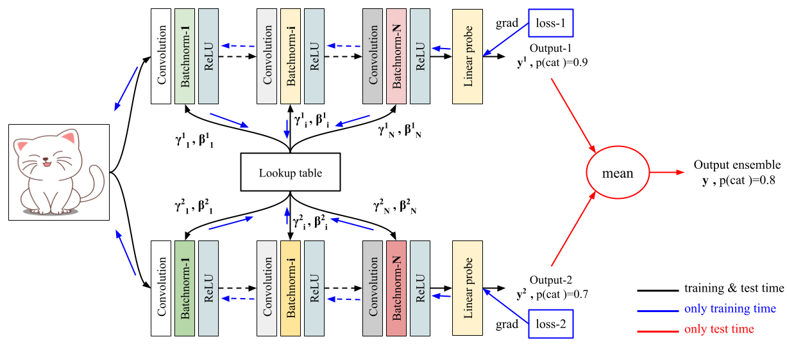

# FiLM-Ensemble: Probabilistic Deep Learning via Feature-wise Linear Modulation
Mehmet Ozgur Turkoglu, Alexander Becker, Hüseyin Anil Gündüz, Mina Rezaei, Bernd Bischl, Rodrigo Caye Daudt, Stefano D'Aronco, Jan Dirk Wegner, and Konrad Schindler. - **Neurips 2022**.

[ \[Paper on ArXiv\] ](https://arxiv.org/abs/2206.00050)

## 🌌 Overview

Code and models are comming soon...
